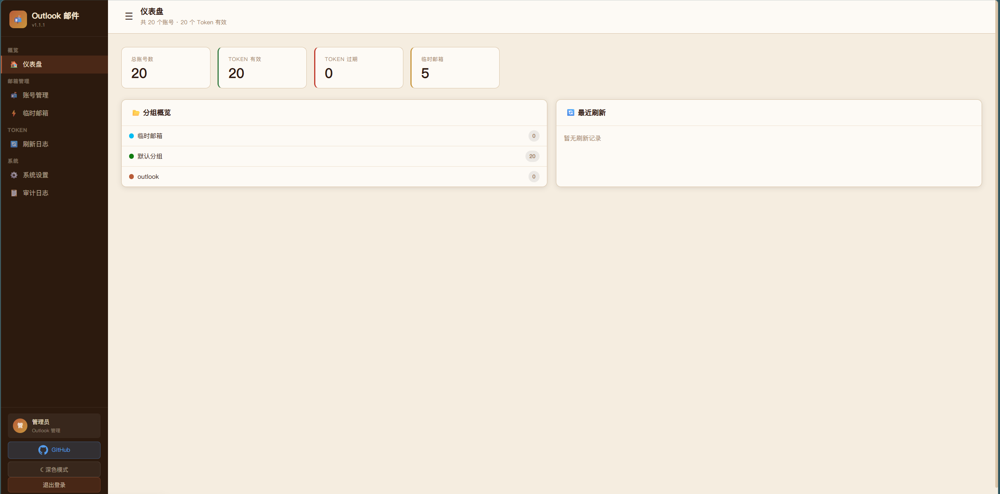
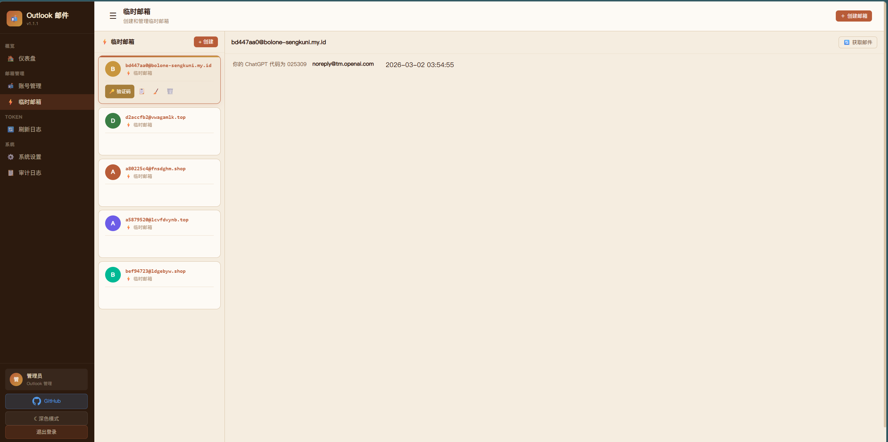
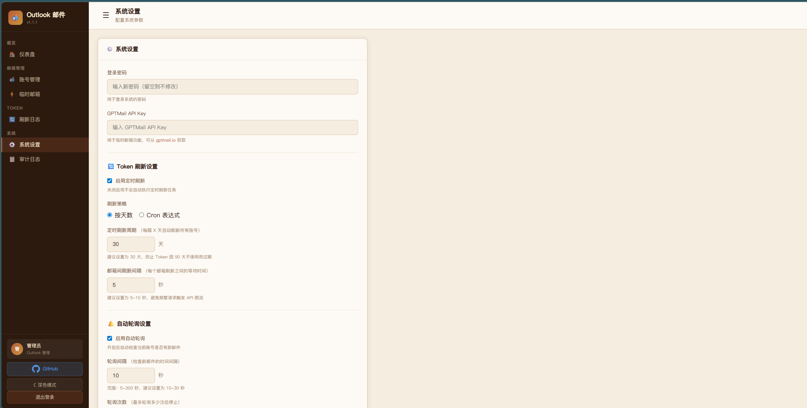

# MailOps

[中文 README](./README.md) · [Docker Deploy](./DEPLOY.md) · [Contributing](./CONTRIBUTING.md) · [Security](./SECURITY.md)

**MailOps** (formerly Outlook Email Plus) is a mailbox **ops** workspace for registration and verification workflows.

Unlike general-purpose clients, it focuses on signup automation, verification extract, mailbox pools, and external APIs. Outlook OAuth, IMAP, pools, provider temp mail, and automation APIs share one directory and contract.

Repo: https://github.com/apaidedie/mailops

**Start here:**

- [Project Launchpad](./docs/project-launchpad.md): understand the product shape, supported mailbox sources, run path, external integration path, and readiness gates in two minutes.
- [Runtime Readiness](./docs/runtime-readiness.md): current local run, provider configuration, external API, and browser-check handoff.
- [Quick Start](#quick-start): run it with Docker or local Python.
- [External API and Mail Pool Integration](#external-api-and-mail-pool-integration): connect registration workers, batch jobs, or other services.
- [External Integration Quickstart](./docs/external-integration-quickstart.md): smoke-check a running instance and start unified mailbox sessions.
- [Provider Onboarding Guide](./docs/provider-onboarding.md): integrate Mail.tm-compatible services, DuckMail, TempMail.lol, Emailnator, or future providers.
- [Browser Extension](#browser-extension): claim a mailbox and extract verification codes from signup pages.
- [UI Preview](#ui-preview): see the current admin workspace screenshots.

### Why OutlookMail Plus

- **Built for registration workflows**: it removes unnecessary steps as much as possible. You can copy mailbox addresses with one click; after sending a verification email on a signup page, you can return to the manager, click "Verification Code", fetch the latest email, and quickly extract the code or verification link with regex.
- **Lighter and more focused**: non-core features such as sending mail are intentionally left out, so the interface stays cleaner and every design choice is centered on completing registration tasks.
- **Broader import compatibility**: it supports mainstream mailbox providers such as Gmail, QQ, and 163, as well as custom IMAP servers. Self-hosted mailboxes also work. Built-in CF Worker temp mailboxes support multi-domain configuration and Admin Key encryption, significantly reducing privacy exposure in registration workflows.
- **Automation-friendly**: it exposes APIs for batch registration workflows; the mail pool supports project-scoped claiming via `project_key`. For long-lived mailboxes, when `project_key + caller_id + task_id` are explicitly provided during claim, a mailbox with a recorded success in the same project will not be re-claimed, and `claim-complete(result=success)` returns it directly to `available`, allowing immediate reuse by other projects. Temp mail / `cloudflare_temp_mail` keep the legacy behavior. Mailbox claiming, verification-code retrieval, and release are all covered.
- **Third-party notifications**: third-party notification channels are supported. Telegram is already integrated, and important mailboxes can push alerts automatically.

In short, OutlookMail Plus is a mailbox manager designed specifically for registration workflows.

## Demo Site

Demo site: https://demo.outlookmailplus.tech/  
Login password: `12345678`

The site includes 10 mailbox accounts for demonstration. Data is periodically reset. Please do not delete the demo accounts or use them for personal purposes.

The demo covers most major features in this project, except Telegram push (which requires additional configuration).

## UI Preview

The repository already includes some screenshots, and more can be added later.






## Version Highlights

Current stable version: `v2.7.0`

### Recent Version Overview

| Version | Date | Key New Features |
|---------|------|-----------------|
| **v2.2.0** | 2026-04 | 🔌 **Temp Mail Provider Plugin System**: dynamic install/unload/configure/hot-reload for third-party providers; built-in Cloudflare / Compatible Temp Mail Bridge / Moemail; provider settings decoupled from domain selection; browser extension adds local personal-info generator and full Jest coverage |
| **v2.1.0** | 2026-04 | 📊 **Overview Dashboard**: a 5-tab unified board (Summary / Verification / External API / Mailbox Pool / Activity), plus `verification_extract_logs` for shared observability, browser-extension API-key copy fix, and overview real-time/i18n polish |
| **v2.0.0** | 2026-04 | 🌐 **Browser Extension** (Chrome/Edge MV3): one-click claim → auto-extract verification code/link → complete/release, no tab-switching needed; backend adds `chrome-extension://` CORS support |
| **v1.19.0** | 2026-04 | 🔧 Structured refresh-failure hints (error code + actionable steps + trace guide); fixed Selected account refresh early-exit (Issue #45) |
| **v1.18.0** | 2026-04 | 🔄 Mail pool **project-scoped success reuse**: with explicit `project_key + caller_id + task_id`, `success` returns mailbox to `available` for immediate cross-project reuse (DB v22) |
| **v1.17.0** | 2026-04 | 🪝 **Webhook notification channel**: single global URL, co-exists with Email/Telegram; one-click random X-API-Key generation |
| **v1.16.0** | 2026-04 | 🔑 OAuth Token tool upgrade: new "Get Authorization Link" mode for stable cross-environment auth |
| **v1.15.0** | 2026-04 | 🤖 **AI verification-code enhancement**: system-level AI fallback (only when both confidence scores are low), fixed JSON contract; **email alias** (`+tag`) auto-normalization |
| **v1.13.0** | 2026-04 | ⚡ **One-click hot-update**: Watchtower (recommended) and Docker API dual modes, auto-detect new version with in-app banner |
| **v1.11.0** | 2026-04 | 🏊 **Mail pool project isolation** (`project_key`); CF Worker multi-domain + Admin Key encryption; frontend account list pagination; unified poll engine |
| **v1.9.0** | 2026-03 | 🌐 **Bilingual UI** (Chinese/English); unified notification dispatch (Email + Telegram); demo-site password lock |

---

### v2.1.0 — Overview Dashboard & Observability

- Added a 5-tab overview dashboard to replace the old dashboard page
- Added `verification_extract_logs` to unify observability across regular-mailbox, temp-mail, and external-API verification extraction paths
- Fixed the real browser-extension “API invalid” causes: copying masked API keys and misunderstanding `external pool` / `pool_access` prerequisites
- Completed overview real-time refresh and i18n polish, so header / tabs / hover notes / timeline now stay consistent with the main cards

### v2.0.0 — Browser Extension (New)

The `browser-extension/` directory contains a Chrome/Edge Manifest V3 extension. See the [Browser Extension](#browser-extension) section below.

### v1.15.0–v1.16.0 — OAuth Token Tool

- Added a dedicated popup-style token tool for **compatibility-mode account import**
- The supported contract is now fixed to personal Microsoft accounts: Public Client, `tenant=consumers`, and no `client_secret`
- The Azure app registration should use **Accounts in any identity provider or organizational directory and personal Microsoft accounts**; org-only apps fail with `unauthorized_client`, while **Personal Microsoft accounts only** conflicts with the current `/common` validation/runtime model and can fail with `AADSTS9002331`
- If Azure blocks the audience change with `Property api.requestedAccessTokenVersion is invalid`, update `api.requestedAccessTokenVersion` to `2` in the **Manifest** first
- If you hit `AADSTS70000` (unauthorized/expired scope), first verify that the scope used during consent matches the scope used during validation, then run a fresh **forced-consent** authorization
- Recommended minimum Graph delegated permissions: **offline_access + Mail.Read + User.Read**; add **Office 365 Exchange Online → IMAP.AccessAsUser.All** only when IMAP is required
- Supports Graph / IMAP scope presets, error guidance, and JWT audience/scope diagnostics; the frontend now recommends the **Graph mail preset** by default (backend env fallback remains IMAP-compatible)
- Built-in Azure quick-start guide card (5 steps) and tutorial link: <https://real-caption-6d1.notion.site/OutlooKMailplus-token-344463aed7e680099380dc324ecdf1c9?source=copy_link>
- Supports writing refresh tokens into existing Outlook accounts or creating new accounts after validation, while rejecting incompatible configurations

### v1.13.0 — One-Click Update

- Two update methods: Watchtower (recommended) and Docker API self-update (advanced)
- Automatic GitHub release detection with in-app update banner
- Full deployment info detection: image tag, local build, Watchtower connectivity, etc.
- Watchtower "already latest" smart detection (based on Watchtower synchronous behavior)
- Docker API digest pre-check — skips update when already on latest version

### v1.11.0 — Mail Pool & Frontend Enhancements

- **Mail pool project isolation**: `project_key` prevents duplicate claiming in the same project (DB v17)
- **CF Worker multi-domain support**: configure multiple CF Worker domains in Settings; "Sync Domains" button refreshes the list in one click
- **Admin Key encrypted at rest**: `cf_worker_admin_key` stored with `enc:` prefix (DB v18)
- **Frontend account list pagination**: 50 accounts per page for smoother rendering
- **Unified poll engine**: merged dual polling systems (standard + compact) into single `poll-engine`, fixing race conditions and state accumulation

## Core Capabilities

- Multi-mailbox management
  Supports Outlook OAuth, regular IMAP mailboxes, and CF Worker temp mailboxes (multi-domain configuration, Admin Key encrypted at rest)
- Bulk import and organization
  Supports bulk import, tags, search, groups, and export
- Mail reading and extraction
  Supports verification-code extraction, link extraction, and raw message viewing
- Mail pool orchestration
  Supports claiming, releasing, completing, cooldown recovery, and stale-claim recycling; long-lived mailboxes support project-scoped success reuse: same-project claims are blocked by recorded success history, and `success` returns the mailbox to `available` for immediate reuse by other projects; requests without `project_key` and `provider=cloudflare_temp_mail` / temp-mail accounts keep the legacy behavior
- Controlled external APIs
  Supports `X-API-Key` authentication, multiple consumer keys, mailbox scope restrictions, IP allowlists, and rate limits
- Notification delivery
  Supports business email notifications, Telegram push, and test sending
- Demo-site protection
  Supports locking the login-password change entry through environment variables so visitors cannot change the backend password from Settings

## Project Layout

```text
outlook_web/          Main Flask application (controllers / routes / services / repositories)
templates/            Page templates
static/               Frontend scripts and styles
data/                 SQLite data and runtime files
tests/                Automated tests
web_outlook_app.py    Backward-compatible entrypoint
```

## Quick Start

### Docker Deployment

**Option 1: docker run (quick start)**

```bash
docker run -d \
  --name outlook-email-plus \
  -p 5000:5000 \
  -v $(pwd)/data:/app/data \
  -e SECRET_KEY=your-secret-key-here \
  -e LOGIN_PASSWORD=your-login-password \
  -e ALLOW_LOGIN_PASSWORD_CHANGE=false \
  guangshanshui/outlook-email-plus:latest
```

**Option 2: docker-compose (recommended, includes one-click update)**

Save the following as `docker-compose.yml`, then run `docker-compose up -d`:

```yaml
services:
  app:
    image: ghcr.io/zeropointsix/outlook-email-plus:latest   # Recommended (more stable in some regions)
    # image: guangshanshui/outlook-email-plus:latest         # Docker Hub alternative
    container_name: outlook-email-plus
    restart: unless-stopped
    ports:
      - "5001:5000"           # Change to 5000:5000 or any other port
    env_file:
      - .env
    environment:
      SECRET_KEY: "${SECRET_KEY:?Set SECRET_KEY in .env}"
      # One-click update token: leave empty to use the built-in default;
      # for production, set a random strong password
      WATCHTOWER_HTTP_API_TOKEN: "${WATCHTOWER_HTTP_API_TOKEN:-outlook-mail-plus-watchtower-default}"
      # Docker API self-update (optional, advanced)
      # ⚠️ Enabling this allows the container to control other containers via Docker API
      # DOCKER_SELF_UPDATE_ALLOW: "false"
    volumes:
      - ./data:/app/data
      # Docker socket mount (optional, only for Docker API self-update)
      # ⚠️ Mounting docker.sock grants the container full Docker API access
      # - /var/run/docker.sock:/var/run/docker.sock
    labels:
      - "com.centurylinklabs.watchtower.enable=true"
    networks:
      - outlook-net

  watchtower:
    image: containrrr/watchtower:1.7.1
    container_name: watchtower
    restart: unless-stopped
    volumes:
      - /var/run/docker.sock:/var/run/docker.sock
    environment:
      - WATCHTOWER_HTTP_API_TOKEN=${WATCHTOWER_HTTP_API_TOKEN:-outlook-mail-plus-watchtower-default}
      - WATCHTOWER_HTTP_API_UPDATE=true
      - WATCHTOWER_CLEANUP=true
      - WATCHTOWER_HTTP_API_PERIODIC_POLLS=false
    command: --http-api-update --label-enable
    labels:
      - "com.centurylinklabs.watchtower.enable=false"
    networks:
      - outlook-net

networks:
  outlook-net:
    driver: bridge
```

Notes:

- Always mount `data/` to avoid losing the database and runtime data
- `SECRET_KEY` must stay stable and strong; generate a random 64-char value: `python -c "import secrets; print(secrets.token_hex(32))"`
- `WATCHTOWER_HTTP_API_TOKEN` **can be left empty** — both app and watchtower will automatically use the same built-in default, making one-click update work out of the box; for production, use a random strong password
- Once configured, the UI will show an update banner when a new version is detected; click "Update Now" to upgrade
- One-click update **only works with docker-compose deployment**; `docker run` single-container mode is not supported

**Update Methods**: Watchtower is the default (recommended). To use Docker API self-update (no Watchtower required), you need to:
1. Uncomment `DOCKER_SELF_UPDATE_ALLOW` and set it to `"true"`
2. Uncomment the docker.sock volume mount
3. Switch "Update Method" to "Docker API" in Settings
4. ⚠️ Please fully understand the security implications before enabling

> ⚠️ **Troubleshooting**: If you see `client version 1.25 is too old. Minimum supported API version is 1.44` in Watchtower logs, your local Watchtower image cache is stale (the embedded Docker client API is too old). Fix:
> ```bash
> docker compose pull watchtower    # Pull the latest image
> docker compose up -d watchtower   # Recreate the container
> ```
> The `docker-compose.yml` in this repo has pinned Watchtower to `1.7.1` to prevent this issue.

#### ClawCloud / Reverse Proxy Deployment Notes

- Point health checks explicitly to `GET /healthz`. Do not rely on `/`, `/login`, or a 302 redirect chain; in this project, `/` is login-protected and redirects to `/login`
- `no healthy upstream` means the reverse proxy currently has no healthy backend. It does **not** automatically mean the app code crashed; after an update, check the **new container startup logs** and platform events first
- If platform events show `Stopping container`, `FailedKillPod`, or `KillPodSandbox DeadlineExceeded`, the incident includes a platform-side Pod stop/reclaim problem and should not be diagnosed from app logs alone
- This project uses SQLite with a persistent volume by default. During updates, keep it as a **single-instance** deployment; if old and new instances touch the same database file briefly, startup migrations or file-lock waits may cause health-check timeouts
- Treat `TEMP_EMAIL_UPSTREAM_READ_FAILED` separately from `no healthy upstream`: the former is a temp-mail upstream read failure, while the latter means the ingress layer has no healthy app instance behind it

### Local Run

```bash
python -m venv .venv
pip install -r requirements.txt
python web_outlook_app.py
```

If you do not have real Outlook/IMAP or temp-mail provider credentials yet, seed the local demo database first. It lets you inspect the unified mailbox directory, temp-mail inboxes, mailbox pool, and external API dashboard with synthetic data:

```bash
python scripts/seed_demo_workspace.py --reset
```

Then start the app with the generated `output/demo/outlook-email-plus-demo.db` database:

```powershell
$env:DATABASE_PATH="output/demo/outlook-email-plus-demo.db"
$env:SCHEDULER_AUTOSTART="false"
python web_outlook_app.py
```

### Run Tests

```bash
python -m unittest discover -s tests -v
```

Before publishing, deployment handoff, or external-service integration, run the local read-only readiness gate:

```bash
python scripts/project_readiness_check.py
python scripts/project_readiness_check.py --format json
```

## Common Environment Variables

- `SECRET_KEY`
  Required for session security and sensitive-data encryption
- `LOGIN_PASSWORD`
  Initial backend login password; after first startup it is hashed and stored in the database
- `ALLOW_LOGIN_PASSWORD_CHANGE`
  Whether login password changes are allowed in Settings. For demo sites, set this to `false`
- `DATABASE_PATH`
  SQLite database path. Default: `data/outlook_accounts.db`
- `PORT` / `HOST`
  Web server bind address
- `SCHEDULER_AUTOSTART`
  Whether background scheduler jobs start automatically
- `OAUTH_TOOL_ENABLED`
  Enables or disables the OAuth token tool entry and related APIs, default `true`
- `OAUTH_CLIENT_ID`
  Outlook OAuth application ID
- `OAUTH_CLIENT_SECRET`
  Must remain empty in compatibility mode; Azure apps that require a `client_secret` are outside the supported contract
- `OAUTH_REDIRECT_URI`
  Outlook OAuth callback URL
- `OAUTH_SCOPE`
  Backend environment default scope (fallback): `offline_access https://outlook.office.com/IMAP.AccessAsUser.All`; frontend first-render default uses Graph preset
- `OAUTH_TENANT`
  Default tenant for the token tool, fixed to compatibility-mode `consumers`
- `GPTMAIL_BASE_URL`
  Compatible temp-mail bridge service root URL, for example `https://mail.chatgpt.org.uk`. The `GPTMAIL_*` variable names are kept for legacy deployment compatibility; if an API docs page URL such as `/zh/api` is entered, runtime requests normalize it back to the service root
- `GPTMAIL_API_KEY`
  API key used by the compatible temp-mail bridge. When left empty, that bridge is reported as needs-config. New deployments can also prefer `mail_tm`, `duckmail`, `tempmail_lol`, `emailnator`, `cloudflare_temp_mail`, or plugin providers
- `TEMP_MAIL_PROVIDER`
  Deployment-level temp-mail provider override. Supported built-ins include `legacy_bridge`, `mail_tm`, `duckmail`, `tempmail_lol`, `emailnator`, and `cloudflare_temp_mail`; leave empty to use the value saved in settings. `legacy_bridge` is for self-hosted or compatible temp-mail bridge deployments
- `EXTERNAL_POOL_DEFAULT_PROVIDER`
  Deployment-level default provider for external pool claims. Used when `POST /api/v1/external/pool/claim-random` omits `provider`; set `auto`, an account provider, or a temp-mail provider, or leave empty for automatic claiming
- `ACTIVE_MAILBOX_PROVIDERS`
  Mailbox provider allowlist. Leave empty to enable all providers; when set, only these providers are exposed and used. Accepts comma- or newline-separated values such as `duckmail,mail_tm`, `imap`, or `legacy_bridge`. Compatibility aliases such as `gptmail`, `legacy_gptmail`, and `temp_mail` still normalize to the compatible bridge
- `OUTLOOK_EMAIL_PROVIDER_CONFIG_FILE`
  Provider selection config-file path. Supports JSON/TOML and can declare `temp_mail_provider`, `pool_default_provider`, and `active_mailbox_providers`; priority is lower than environment variables and higher than saved settings
- `MAILTM_API_BASE`
  Mail.tm-compatible API base URL, default `https://api.mail.tm`
- `DUCKMAIL_API_BASE` / `DUCKMAIL_BEARER_TOKEN`
  DuckMail API base URL and Bearer token
- `TEMPMAIL_LOL_API_KEY` (also accepts `TEMP_MAIL_LOL_API_KEY`)
  TempMail.lol API key; leave empty to use the public free API behavior
- `EMAILNATOR_API_KEY` / `EMAILNATOR_EMAIL_TYPES`
  Emailnator RapidAPI key and email type JSON array
- `CF_WORKER_BASE_URL` / `CF_WORKER_ADMIN_KEY`
  Cloudflare Temp Email Worker URL and admin password. Values saved from the settings page take priority and are encrypted at rest

External consumers can first call `GET /api/v1/external/capabilities` or `GET /api/v1/external/providers` and read the top-level `integration_manifest`. It is the preferred machine-readable starter contract for automation: `auth` documents the `X-API-Key` header and `<your-api-key>` placeholder, `discovery.recommended_sequence` lists the capabilities, providers, and mailboxes discovery calls, `selection` documents source priority and provider override request fields, `deployment` provides env/config templates, and `providers[*].env` plus `providers[*].settings` list provider configuration keys. Secret key names can appear, for example `DUCKMAIL_BEARER_TOKEN`, but secret hint `value` fields are always empty strings. Non-secret defaults such as `MAILTM_API_BASE=https://api.mail.tm` and `DUCKMAIL_API_BASE=https://api.duckmail.sbs` may appear as defaults. The older `/api/external/*` paths remain available as legacy aliases for existing clients.

When integrating or adding mailbox sources, start with the [Provider Onboarding Guide](./docs/provider-onboarding.md). Runtime `integration_manifest`, `provider_integration_guide`, and unified mailbox `provider_context` payloads also expose a `documentation` object so external projects can discover the human guide, API docs page, OpenAPI contract, `.env.example`, and JSON/TOML config examples from the API itself.

`provider_integration_guide` remains available as the detailed per-provider guide. Each catalog item includes `selection`, `configuration`, and `deployment`; `deployment` gives machine-readable values for activating the provider, making it the default temp-mail provider, making it the default pool-claim provider, request fields, and required environment variables/settings. The top-level `deployment_profile` aggregates provider values, required/optional/secret environment variables, settings keys, and per-provider activation examples; its `templates` object returns a ready-to-write `.env` template plus JSON/TOML templates for provider selection only. The top-level `selection_policy` is the unified provider-selection contract for external callers: read `source_priority` for env, provider config file, settings, and default precedence; read `scopes` to know which field controls the active allowlist, runtime temp-mail default, pool-claim default, and per-request provider selection; read `templates` to generate deployment config. `provider_diagnostics` reports local readiness as `ready`, `needs_config`, or `inactive`, and its `defaults` object reports whether `TEMP_MAIL_PROVIDER` and `EXTERNAL_POOL_DEFAULT_PROVIDER` point to valid and currently enabled providers; it only reads local settings, environment variables, and the allowlist, and does not call upstream providers. To explicitly probe a temp-mail upstream, call `GET /api/v1/external/providers/{kind}/{provider}/health?probe_network=true`; without `probe_network=true`, that endpoint returns local readiness only. `POST /api/v1/external/pool/claim-random` accepts account providers, temp-mail providers, or `auto` from that catalog; when `provider` is omitted, the service uses `EXTERNAL_POOL_DEFAULT_PROVIDER` or the `pool_default_provider` setting, and falls back to automatic claiming when both are empty. `ACTIVE_MAILBOX_PROVIDERS` or the `active_mailbox_providers` setting can restrict an instance to selected providers; provider discovery, `auto` claiming, explicit provider claiming, and task temp-mail apply all honor the allowlist. When an explicit temp-mail provider is requested and the local pool is empty, the service creates and claims a mailbox from that provider. `auto` does not create upstream mailboxes. `POST /api/v1/external/temp-emails/apply` accepts `provider_name` for task-scoped temp-mail creation.

External consumers can also open `GET /api/v1/external/docs` with `X-API-Key` for the built-in API documentation page, or call `GET /api/v1/external/openapi.json` to retrieve the OpenAPI 3.1 contract for client generation, response-field validation, and endpoint discovery. Its `x-capabilities.integration_manifest` section mirrors the starter contract above. The docs page and OpenAPI contract describe external API shape only and do not echo provider secrets or plaintext API keys.

Authenticated admin UI clients can call `GET /api/mailboxes` for the unified mailbox directory. External consumers can call `GET /api/v1/external/mailboxes` with `X-API-Key` for the same mailbox DTO, wrapped in the external API envelope `{success, code, message, data}`. The endpoint normalizes Outlook/IMAP accounts and user-visible temp mailboxes into one mailbox DTO, supports `kind=all|account|temp`, `status`, `read_capability=all|graph|imap|temp_provider`, `action=all|read_messages|refresh_auth|delete_remote_mailbox|delete_message|clear_messages`, `provider=all|provider_key`, `search`, `sort=updated_desc|created_desc|email_asc|provider_asc|status_asc`, `page`, and `page_size`, and returns `facets.kinds`, `facets.statuses`, `facets.read_capabilities`, `facets.providers`, `facets.actions`, `provider_context`, `contract.version=1`, plus stable IDs in `{kind}:{source_id}` format. Fixed filter facets count every contract enum value in the current context without self-narrowing by their exact filter, so `facets.statuses` is not narrowed by `status` and `facets.actions` is not narrowed by `action`; clients can render counted filter options directly. Each item also returns `actions` and `action_contract`: `actions` is the per-mailbox operation capability map, `action_contract.external` reuses the unified external read contract and pre-fills the current mailbox `email` query parameter, while `action_contract.internal.open_mailbox` tells the admin UI whether to open the regular account view or the temp-mail view. `provider_context` exposes current defaults, the active allowlist, provider diagnostics, selection policy, and ready-to-write `.env`/JSON/TOML deployment templates so external projects can switch mailbox sources through environment variables or config files. For multi-key consumers with `allowed_emails`, the external directory scopes account records before summary, facets, and pagination are computed; user-visible temp mailboxes remain visible under the current read contract, while task temp mailboxes are not listed. It only returns metadata needed for display and workspace orchestration; it does not expose refresh tokens, IMAP passwords, temp-mail task tokens, consumer keys, or upstream temp-mail secrets. Message reads should use the `/api/v1/external/*` read endpoints referenced by `action_contract.external`; the admin UI can keep using the `/api/emails/*` or `/api/temp-emails/*` targets referenced by `action_contract.internal`.

`.env.example` includes these provider selection switches. When deploying with `docker-compose.yml`, `TEMP_MAIL_PROVIDER`, `EXTERNAL_POOL_DEFAULT_PROVIDER`, `ACTIVE_MAILBOX_PROVIDERS`, `OUTLOOK_EMAIL_PROVIDER_CONFIG_FILE`, and provider credentials are automatically injected from `.env` into the container. Provider selection priority is environment variables, provider config file, saved settings, then built-in defaults. See `.runtime/providers.example.json` and `.runtime/providers.example.toml` for config-file examples.

### One-Click Update

- `WATCHTOWER_HTTP_API_TOKEN`
  Watchtower API auth token. **Can be left empty** — both app and watchtower automatically use the same built-in default, making it work out of the box; for production, use a random strong password
- `WATCHTOWER_API_URL`
  Watchtower API address, default `http://watchtower:8080` (Docker internal network, usually no need to change)
- `DOCKER_SELF_UPDATE_ALLOW`
  Whether to enable Docker API self-update, default `false`. ⚠️ Grants container Docker API access when enabled
- `DOCKER_IMAGE`
  Current container image name (optional, for deployment info detection)

> **Security Note**: Docker API self-update requires mounting `/var/run/docker.sock`, which grants full Docker API access to the container. For production environments, Watchtower is recommended.

## Notification Channels

### Email Notifications

If you want to enable business email notifications, you need to configure SMTP separately. Email notifications, Telegram, and temp-mail providers are independent channels and do not replace each other.

Minimum required variables:

- `EMAIL_NOTIFICATION_SMTP_HOST`
- `EMAIL_NOTIFICATION_FROM`

Common optional variables:

- `EMAIL_NOTIFICATION_SMTP_PORT`
- `EMAIL_NOTIFICATION_SMTP_USERNAME`
- `EMAIL_NOTIFICATION_SMTP_PASSWORD`
- `EMAIL_NOTIFICATION_SMTP_USE_TLS`
- `EMAIL_NOTIFICATION_SMTP_USE_SSL`
- `EMAIL_NOTIFICATION_SMTP_TIMEOUT`

Example:

```env
EMAIL_NOTIFICATION_SMTP_HOST=smtp.qq.com
EMAIL_NOTIFICATION_SMTP_PORT=465
EMAIL_NOTIFICATION_FROM=your_account@qq.com
EMAIL_NOTIFICATION_SMTP_USERNAME=your_account@qq.com
EMAIL_NOTIFICATION_SMTP_PASSWORD=your_smtp_auth_code
EMAIL_NOTIFICATION_SMTP_USE_SSL=true
EMAIL_NOTIFICATION_SMTP_USE_TLS=false
EMAIL_NOTIFICATION_SMTP_TIMEOUT=15
```

Notes:

- the Settings page follows a save-first-then-test flow
- the test endpoint does not read temporary values from the form
- the system only uses the saved `email_notification_recipient`

### Telegram Push

The Settings page supports:

- `telegram_bot_token`
- `telegram_chat_id`
- `telegram_poll_interval`

In the current version, Telegram push and business email notifications are both handled by the unified notification-dispatch flow.

## External API and Mail Pool Integration

If you want to connect this project to registration workers, script platforms, or other automation systems, the recommended path is the controlled external API:

For the shortest working path, start with [External Integration Quickstart](./docs/external-integration-quickstart.md). It covers read-only smoke checks, `integration_manifest` discovery, `/api/v1/external/mailbox-sessions/start`, read actions, and lifecycle close-out examples.

For code you can embed into another service, start with [`examples/external_api_python_client.py`](./examples/external_api_python_client.py). It is a zero-dependency copyable Python starter for discovery, unified mailbox-session start, verification-code reads, and finally-based lifecycle close-out; its CLI `discover` command is read-only, while `verification-code` starts and closes one mailbox session.

- path prefix: `/api/v1/external/*` (`/api/external/*` remains as a legacy alias)
- auth header: `X-API-Key`
- mail-pool endpoints: `/api/v1/external/pool/*`

Current external API capabilities include:

- single-key authentication
- multi-key configuration
- mailbox scope restrictions per caller
- public-mode allowlists and rate limits
- the ability to disable risky endpoints such as raw-content reading and long polling
- `/api/v1/external/docs` for the built-in external API documentation page covering auth, provider selection, and mailbox-session workflows
- `/api/v1/external/openapi.json` for the external API OpenAPI 3.1 machine-readable contract
- `/api/v1/external/capabilities` discovery for unified mailbox directory, provider, mail-read, pool, and task temp-mail contracts
- `integration_manifest` from capabilities, providers, or OpenAPI `x-capabilities` for generating secret-safe external env/config starter settings
- `/api/v1/external/mailboxes` for the external caller-visible unified mailbox directory with provider, kind, status, read mode, action capability, search, and fixed sort filters

Notes:

- the old anonymous `/api/pool/*` endpoints have been removed
- in production, controlled public mode with allowlists is recommended

## Browser Extension

The `browser-extension/` directory contains a companion Chrome / Edge extension (Manifest V3). It provides a one-stop panel for the full claim → verification → complete/release flow without switching tabs.

Full usage guide: [browser-extension/README.md](./browser-extension/README.md)

### Project Key

The project key enables **multi-tenant isolation** in the mail pool — different projects' claims are kept separate. Combined with `caller_id + task_id`, it also prevents duplicate assignments within the same project.

- **Omit**: claim from the shared public pool
- **Set**: claim only from that project's mailboxes; after a `success` complete, the mailbox returns to `available` immediately and can be reused by other projects

### Complete vs Release

Both operations end the current task; the difference is what happens to the mailbox:

| Operation | Mailbox status | When to use |
|-----------|---------------|-------------|
| **Release** | → `available` (claimable again immediately) | Registration failed, wrong mailbox, test return |
| **Complete** | → `used` (marked used, not re-assigned by default) | Registration succeeded, verification code consumed |

> When project reuse is enabled, `complete(result=success)` with an explicit `project_key` returns the mailbox directly to `available` for cross-project reuse.

## Demo Site Recommendation

If you want to expose a demo site to other users, at minimum use:

```env
LOGIN_PASSWORD=your-strong-password
ALLOW_LOGIN_PASSWORD_CHANGE=false
```

- the site remains usable
- visitors cannot change the backend login password from Settings

## Project Documentation

- [Project Launchpad](./docs/project-launchpad.md)
- [Runtime Readiness](./docs/runtime-readiness.md)
- [External Integration Quickstart](./docs/external-integration-quickstart.md)
- [Provider Onboarding Guide](./docs/provider-onboarding.md)
- [Registration Worker and Mail Pool API (ZH)](./docs/registration-mail-pool-api.zh.md)
- [Registration Worker and Mail Pool API (EN)](./docs/registration-mail-pool-api.en.md)
- [Temp Mail Provider Plugin Guide](./docs/temp-mail-provider-plugin-guide.md)
- [Temp Mail Provider Plugin Prompt](./docs/temp-mail-provider-plugin-prompt.md)

If you plan to integrate registration workers, batch workflows, or new mailbox sources, start with the Provider Onboarding Guide.

## Acknowledgements

This project is built on:

- Flask
- SQLite
- Microsoft Graph API
- IMAP
- APScheduler

It also draws ideas from:

- [assast/outlookEmail](https://github.com/assast/outlookEmail)
- [gblaowang-i/MailAggregator_Pro](https://github.com/gblaowang-i/MailAggregator_Pro)

## License

Apache License 2.0

## Contact

For project-related issues or collaboration opportunities, feel free to reach out via email: [outlookmailplus@163.com](mailto:outlookmailplus@163.com)
